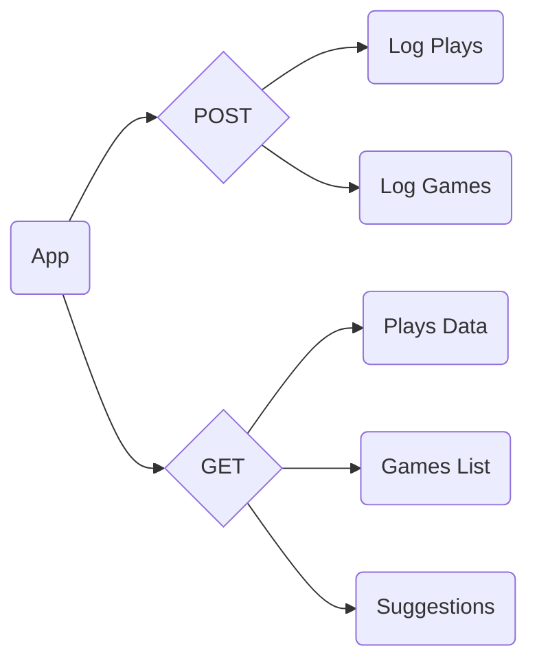

# gamelogger
Keep track of your collection, choose what to play next, log your plays and scores

```mermaid
graph LR
    B(App)
    B --> C{POST}
    B --> D{GET}

    C --> E(Log Plays)
    C --> F(Log Games)

    D --> G(Plays Data)
    D --> H(Games List)
    D --> I(Suggestions)
    ;

```