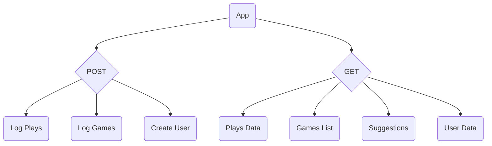

# Gamelogger
Keep track of your collection, choose what to play next, log your plays

## Post

### Log Plays
Use the app to record a game having been played, including the game that was played, who played it, and who won.

### Log Games
Add/remove games to/from your collection. Initially manually, but ideally via a search and an API link to BGG.

### Create User
Add/remove users to/from the app, so that games and plays can be associated with them (see [Data](/data/data.md)).

## Get

### Plays Data
Request play data for games(s) and user(s) (including filtering and search).

### Games List
Request a list of games in a player's collection (including filtering and search).

### Suggestions
Get a suggestion for what game to play next. See [Suggestions](/##Suggestions).

### User Data
Request a copy of the user account data held (currently name and email address).

## Suggestions
Players should be able to request a suggestion of which game to play next. They should also be able to constrain the suggestion by weight, player count, and how often or recently the game was played (i.e. games should be weighted for suggestions so that games with less plays, or plays less recently, are at the top of the suggestion list). The intent of this last feature is to help players work through their collection, and stop games from going unplayed.